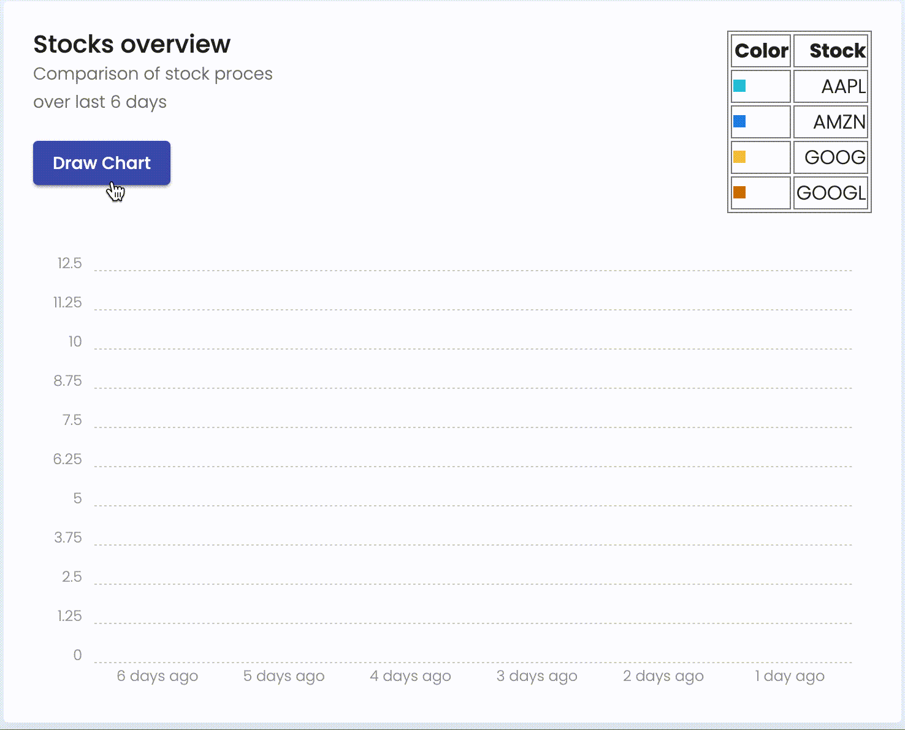
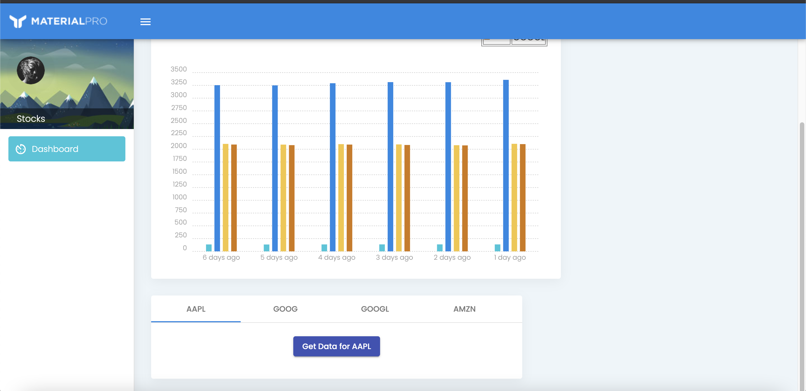
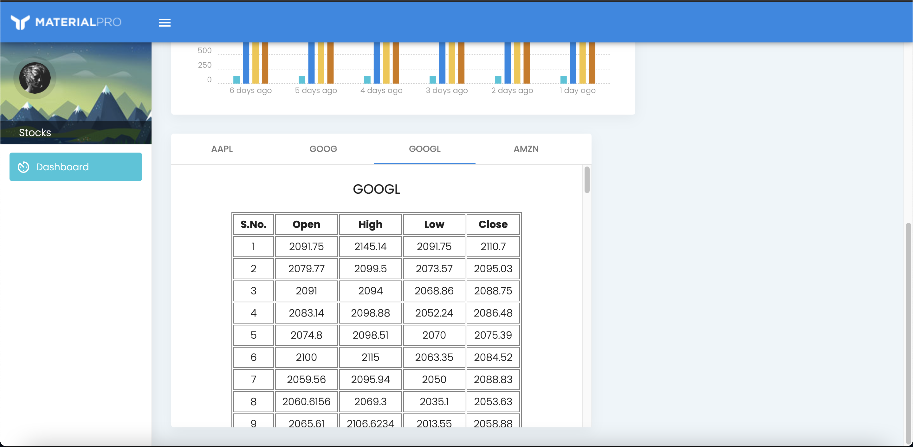

# DevCom Assignment

Created using theme from [here](https://www.wrappixel.com/templates/materialpro-angular-lite/#comparison).

Requirements (Not completely sure if there are any other dependencies, but this is what is on my system and it works)  
Angular CLI: 10.0.1  
Node: 14.5.0

To run:
Clone the repository, `cd` into it and run `npm install`. Then run `ng serve`. This will host the site at `localhost:4200`.

Demo:
 

